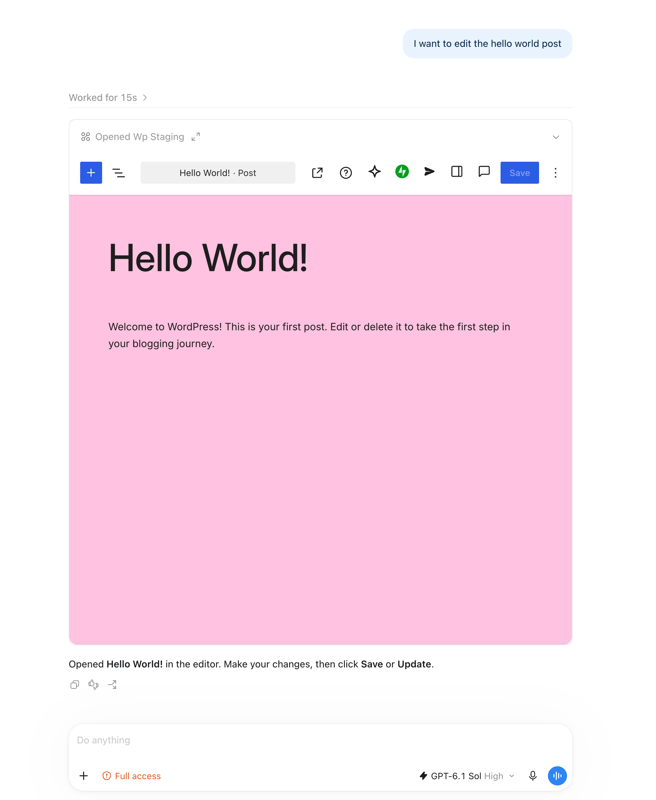
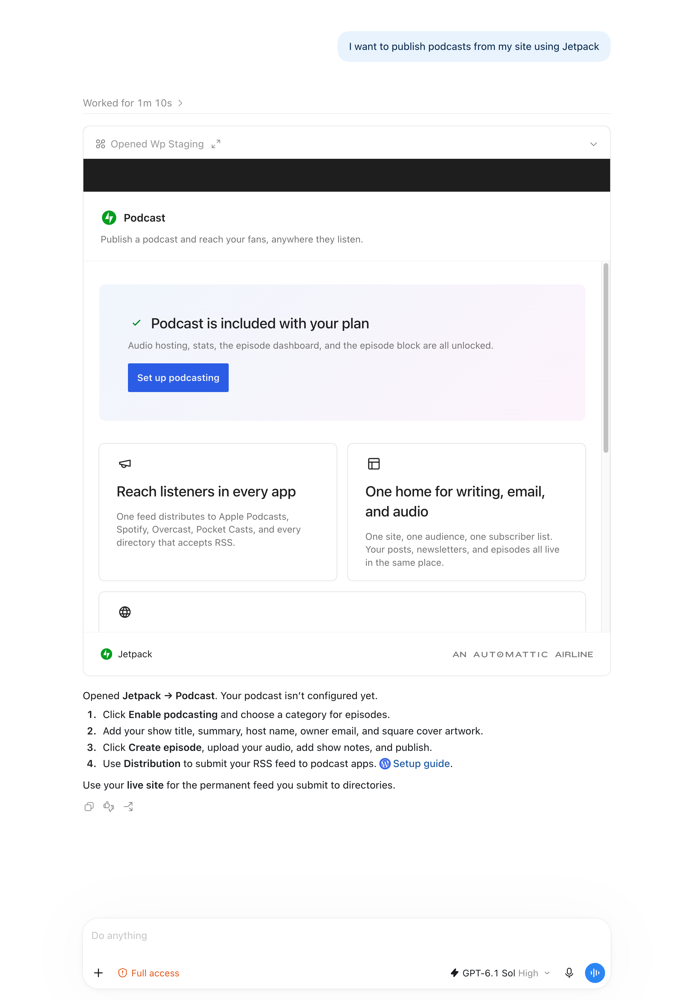

# WP AI Fragments

> **Development status:** This plugin is still in development and is not ready for production use.

Display native WordPress admin pages as interactive MCP Apps in a supported chat client. Dashboard, post lists, editors, settings, media, and plugin admin pages keep their original WordPress UI and save handlers. WordPress checks the connected user's permissions and nonces for each screen and save.

The model-facing tool is:

```json
{"name":"show_wp_admin","arguments":{"url":"/wp-admin/"}}
```

`url` accepts an admin path or a full URL on the site's configured origin. Query strings and fragments are preserved; external URLs and paths outside the site's admin directory are rejected. Embedded posts and pages use Gutenberg even when Classic Editor is active. Ordinary browser sessions retain the site's editor selection; other post types follow the site's configuration.

## Screenshots

Open the native WordPress post editor directly in chat.



Open plugin admin pages, such as Jetpack's podcast setup, in the same chat.



## Set up with an agent

Give your agent this prompt:

```text
Fetch https://raw.githubusercontent.com/bgrgicak/wp-ai-fragments/trunk/setup.md and follow its instructions to set up WP AI Fragments. Reuse my existing WordPress site or running local environment when available, connect my MCP client, and verify that the native admin card renders. Report any step you could not verify.
```

The [agent setup guide](setup.md) covers existing WordPress sites and local development. Agents working in this repository should also read [AGENTS.md](AGENTS.md).

## Install on an existing WordPress site

### 1. Check requirements

- A WordPress site with PHP **8.0+**, HTTPS, REST API access, and WordPress Application Passwords available for the account you will connect.
- Permission to install and activate a plugin. The MCP account needs the WordPress capabilities for the screens you want to open; an editor can edit its permitted posts but cannot manage site settings.
- An MCP Apps client using the supported **Codex viewer profile**, able to send a Basic Authorization header over HTTP. The plugin accepts Codex's isolated MCP viewer origins and its bundled test viewer; other viewers need code changes before browser handoff will work.
- To build from source: Git, npm **8.19.2+**, Node.js **22.12+** (Vite also supports Node 20.19+ on the 20.x line), and Python 3. The WordPress server needs neither Node.js nor Python.

This is experimental. Browser sessions last 20 minutes; production session renewal, revocation management, and expired-ticket cleanup are not implemented.

### 2. Build and install

```sh
git clone https://github.com/bgrgicak/wp-ai-fragments.git
cd wp-ai-fragments
npm ci
npm run package
```

`npm run package` builds the viewer and writes `dist/wp-ai-fragments.zip`. In WordPress, open **Plugins → Add New Plugin → Upload Plugin**, select that ZIP, install it, and activate **WP AI Fragments**. No additional WordPress plugins are required. WooCommerce is needed only to open WooCommerce admin screens.

For a manual upload, preserve these paths under `wp-content/plugins/wp-ai-fragments/`, then activate the plugin:

```text
wp-ai-fragments.php
experiments/native-admin/native-admin.php
experiments/native-admin/dist/view.html
```

`npm run build` generates the standalone viewer HTML with its JavaScript and CSS included. The WordPress host does not need a development server.

### 3. Create credentials and connect MCP

1. Use a dedicated WordPress account with the capabilities needed for the intended screens.
2. Open that account's **Users → Profile → Application Passwords**, create a named password such as `WP AI Fragments`, and store it in your client's secret storage. WordPress shows it only once. Use the application password, rather than the account's login password.
3. Add one HTTP MCP connection named `wp-native-admin` with this endpoint:

   ```text
   https://your-site.example/wp-json/aif-proof/v1/mcp
   ```

   Include the WordPress subdirectory when present, for example `https://your-site.example/blog/wp-json/aif-proof/v1/mcp`. Configure HTTP Basic authentication with the WordPress username and application password. If the client accepts only headers, set `Authorization: Basic <base64(username:application-password)>` privately; the encoded value is a secret too.
4. Reconnect or reload the MCP connection to discover its tools and resources.

The HTTP endpoint implements initialization, ping, tool discovery/calls, and resource discovery/reads. There is no OAuth flow or separate hosted MCP service. The bundled STDIO bridge accepts only loopback WordPress URLs; use direct HTTP for a remote site.

### 4. Verify the connection

Discover `show_wp_admin` and `ui://wp-ai-fragments/wp-admin-v1.html`. Raw discovery also lists `open-session` with app-only visibility; the viewer uses it for private browser handoff.

Ask the client to open `/wp-admin/`. For a subdirectory site, use its actual admin path, such as `/blog/wp-admin/`. Confirm a native dashboard appears inside the chat with surrounding admin chrome hidden, then open the post list and a screen permitted for the account. Tool discovery alone does not prove browser framing or cookies work. For a save check, edit a disposable draft, save in the native editor, and independently reopen it to confirm persistence. See [TESTING.md](TESTING.md) for full acceptance checks.

## Local development

The configured `wp-env` runtime uses WordPress Playground with WordPress 7.0.4 and PHP 8.3. It installs this plugin and Classic Editor and runs without Docker.

### Start or reuse WordPress

Install the build prerequisites above. Automatic provisioning also requires macOS Keychain (`security`), `curl`, `jq`, Perl, OpenSSL, and `uuidgen`. Local PHP 8.0+ is needed for PHP lint and fixture tests.

```sh
npm ci
npm run dev:status
```

If WordPress is stopped and you want a disposable local site:

```sh
npm run dev:start
```

This starts Playground, creates or finds the dedicated `wp-ai-agent` administrator, creates an application password in Keychain service `wp-ai-fragments-mcp`, activates the plugin, and builds the viewer. Each provisioning run creates a new application password. Local admin is `http://localhost:8888/wp-admin/`, with development login `admin` / `password`.

**Starting Playground creates a fresh database.** Keep a running site alive while iterating; do not restart it to refresh a card. For an already-running environment:

```sh
python3 experiments/native-admin/setup-local.py
npm run build
```

If MCP credentials are missing, `npm run dev:provision` provisions them without restarting WordPress. `setup-local.py` also deactivates the prior proof entrypoint and old local WooCommerce editor override when present.

### Credentials without macOS Keychain

`dev:start` includes macOS-specific provisioning. On another platform, start a stopped site directly and complete setup manually:

```sh
npx wp-env start --runtime=playground
python3 experiments/native-admin/setup-local.py
npm run build
test -f .wp-env.mcp.local || cp .wp-env.mcp.local.example .wp-env.mcp.local
```

Create an Application Password in the local WordPress profile UI for `admin` or a dedicated account you create. Set `WP_MCP_USERNAME` in the ignored `.wp-env.mcp.local` to that account and privately enter its application password and the site URL. This manual path does not create `wp-ai-agent`, which is the example file's default. The wrapper sources this file as shell code; quote values as needed and use a trusted file. Do not commit or print credentials.

Alternatively, pass `WP_ENV_SITE_URL`, `WP_MCP_USERNAME`, and `WP_API_PASSWORD` through the MCP client's private environment settings. `WP_API_PASSWORD` takes precedence over Keychain. The bridge permits only `localhost` and `127.0.0.1` hosts.

### Register local STDIO

Configure one MCP registration named `wp-native-admin`:

| Setting | Value |
| --- | --- |
| Transport | STDIO |
| Command | `sh` |
| Arguments | `["/absolute/path/to/wp-ai-fragments/scripts/mcp-proxy.sh"]` |

Replace the placeholder with your checkout's absolute path. The wrapper loads `.wp-env.mcp.local` if present and starts the bridge. With Keychain or client-provided environment variables, an existing registration using `node` with the absolute path to `experiments/native-admin/mcp-server.mjs` can remain in place. Keep one registration to avoid duplicate tools. `npm run mcp:start` runs the wrapper for transport debugging; it waits for JSON-RPC on STDIN.

Rebuild after changing `view.js` or `view.html`, then open a fresh card. WordPress serves the bundle on each resource read; existing cards retain their old tool results. Reconnect MCP when changing discovery or registration.

### Browser transport for local development

Use a configured public HTTPS tunnel, such as Jurassic Tube, forwarding to the restricted proxy at `127.0.0.1:8893`. Write the assigned HTTPS origin to the ignored `experiments/native-admin/.https-demo` file. See [the development tunnel guide](docs/development-tunnel.md) for generic account, hostname, and SSH examples. The bridge checks public bootstrap availability; TLS overrides apply only to local WordPress environments.

For separate local browser debugging, run `node experiments/native-admin/serve.mjs` and open `http://127.0.0.1:8890/`. This builds `host.html` and starts a credentialed loopback test harness, intended to stay local. The harness and live tests read environment variables or Keychain; they do not load `.wp-env.mcp.local` automatically. If you use that trusted file, export its variables in the terminal first:

```sh
set -a
. ./.wp-env.mcp.local
set +a
```

Its browser may have different frame and cookie policies from Codex. Successful local protocol tests do not guarantee visible chat cards.

### Verify changes

```sh
php -l wp-ai-fragments.php
php -l experiments/native-admin/native-admin.php
node experiments/native-admin/test-bootstrap.mjs
node experiments/native-admin/test-view.mjs
```

The Node commands above run isolated fixtures; `test-bootstrap.mjs` also invokes PHP. `npm test` runs live STDIO and HTTP checks and requires a running disposable local site, credentials, and the expected origin/transport configuration. Its protocol checks create, save, read, and delete a temporary draft. Consult [TESTING.md](TESTING.md) before the full suite.

When the site's data is no longer needed, stop it with `npm run dev:stop`. `npm run dev:destroy` destroys the local environment; use it only when you intend to discard it.

## Troubleshooting

| Symptom | Check or fix |
| --- | --- |
| Build fails with a Node engine error | Use a supported Node version, then rerun `npm ci`. |
| Provisioning fails | Check `jq` and the other tools, local `admin` / `password` login, and Keychain. WordPress may already be running; check status before continuing manually. |
| HTTP 401 or 403 | Verify the username/Application Password, account capabilities, and that the host forwards the Authorization header. Check that Application Passwords are enabled. |
| MCP route returns 404 | Check plugin activation, the WordPress subdirectory, and REST routing. For direct HTTP without pretty REST URLs, use `https://your-site.example/?rest_route=/aif-proof/v1/mcp`. The local bridge uses the pretty URL. |
| `Local demo only` | Connect remote sites directly over authenticated HTTP. |
| Keychain lookup fails | Provision credentials or privately set `WP_API_PASSWORD`; use the wrapper to load `.wp-env.mcp.local`. |
| `Native admin public connection is unavailable` | Check the configured public origin, restricted proxy, and tunnel to port 8893. |
| Discovery works but the card is empty/rejected | Check HTTPS, browser access to the returned site origin, supported Codex viewer origins, frame headers, and partitioned cookie support. |
| Card offers Reconnect or shows login | Browser sessions expire after 20 minutes; use Reconnect. A stalled frame offers it after 20 seconds. |
| Changes do not appear | Rebuild, reconnect when discovery changed, and open a fresh card. Keep the running Playground database. |

Browser handoff tickets expire after 60 seconds. Cards in the same partition reuse a valid session for the same account, preserving native nonces and the original expiry. A different account cannot replace a live shared session. Handoff and session checks use WordPress's admin directory, including subdirectory installations.
