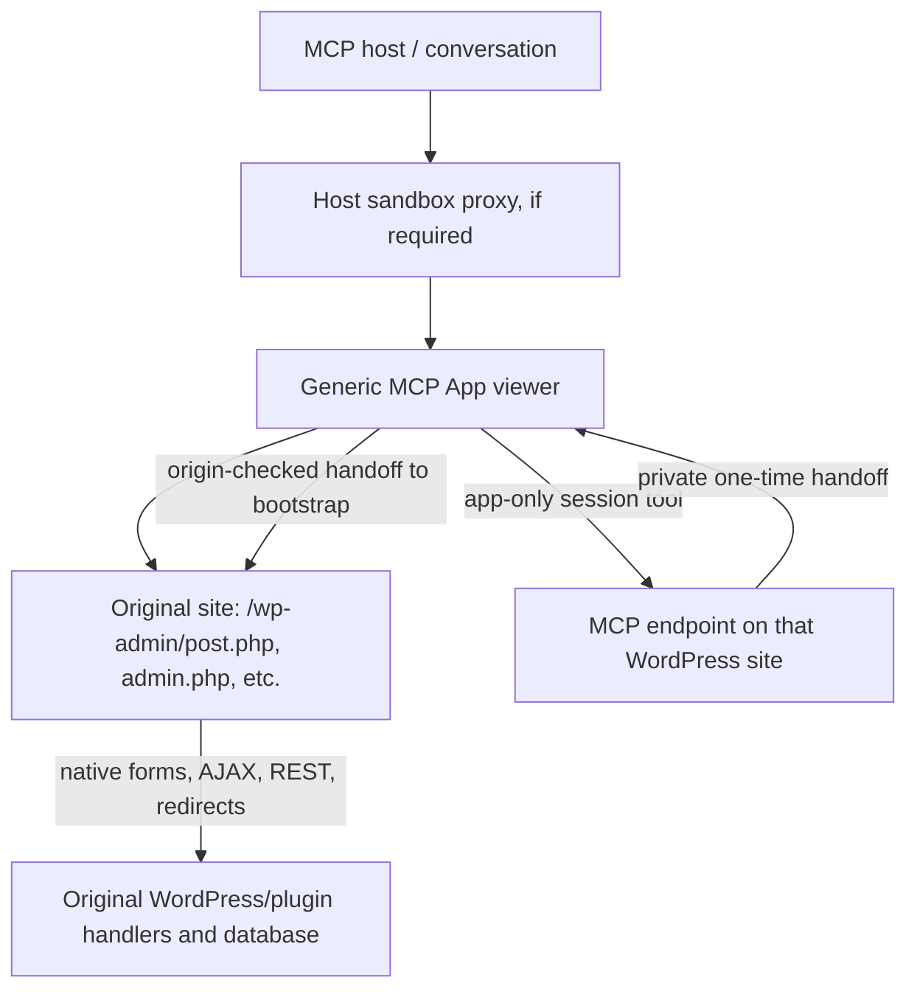

# MCP Apps: embed the original wp-admin document

**Status:** Native Product data demo confirmed in Codex via Jurassic Tube on 21 September 2026; production integration remains pending.

**Original architecture review:** 15 September 2026. See [the final demo findings](../experiments/native-admin/LEARNINGS.md) and [current testing instructions](../experiments/native-admin/TESTING.md) for the later implementation and host-specific results.

## Decision

**Use a generic MCP App containing the site's original wp-admin page, authenticated with a separate partitioned browser session.** Keep the entire WordPress document and its normal URLs. WordPress and the owning plugin render the controls and execute every save.

The [isolated proof](../experiments/native-admin/README.md) loaded real WooCommerce and Yoast controls through the MCP Apps SDK, saved their values with the original WordPress form, and exercised native REST and media-library AJAX. The viewer has no plugin-specific rendering or saving adapters.

The crucial change from the previous proposal is the unit of integration: **a native admin browsing session**, not a fragment-shell response. Authentication and framing permission must survive the requests a real admin screen makes.

This document replaces the previous investigation. The existing custom title/content MCP editor does not implement this design.

## What “universal” can mean

The implementation must be one installable WordPress plugin, use the connected site's own MCP endpoint, and work without individual integrations for WooCommerce, Yoast, ACF, or another plugin. It must render the installed plugin's actual UI. These are achievable architecture requirements.

An unconditional promise of **every site, every plugin, every browser, and every MCP host** is not achievable by a WordPress plugin. A host can forbid subframes or forms. A CDN can add `frame-ancestors 'none'` after PHP finishes. A plugin can deliberately refuse to run in a frame or require top-level third-party authentication. PHP cannot override those decisions.

| Requirement | Design commitment |
| --- | --- |
| One universal WordPress plugin | Generic transport, session bootstrap, and viewer; no plugin adapters |
| Any site's real content | Execute that site's installed WordPress and plugins against its database under the authorized user's identity |
| Any plugin's UI | Preserve the complete native document; do not depend on a plugin's field schema or save API |
| Inline in MCP Apps | Supported when the host grants the necessary browser capabilities |
| Every arbitrary environment | Cannot be guaranteed; diagnose the actual blocked capability |
| Fragment selection | Optional presentation assistance; retain the complete original admin screen when extraction cannot preserve behavior |

A direct admin link is useful failure recovery. It does **not** count as satisfying inline embedding. A custom title/content editor does not count either.

## Review findings

1. **A shell is not a universal WordPress screen lifecycle.** Including `admin.php` or calling a meta-box callback from a REST route does not reproduce `post.php`, `$pagenow`, screen-specific hooks, conditional enqueues, or form targets. Navigate to the original URL.
2. **A header exception limited to one URL breaks navigation.** Native saves can POST to `post.php`, `options.php`, or `admin-post.php`, then redirect elsewhere. Follow authenticated embedded document responses while ordinary sessions retain their protection.
3. **Allow the entire ancestor chain.** A web MCP host may add a sandbox proxy before the viewer. Allowing only the top-level application or only the immediate parent is insufficient. [MDN framing policy](https://developer.mozilla.org/en-US/docs/Web/HTTP/Reference/Headers/Content-Security-Policy/frame-ancestors)
4. **Framing permission does not grant form submission.** Every ancestor sandbox must permit scripts, an origin, and forms. The current reference host enables `allow-forms`; the protocol does not guarantee every host will do so. Descendants cannot restore permissions removed by ancestors. [Reference sandbox](https://github.com/modelcontextprotocol/ext-apps/blob/main/examples/basic-host/src/sandbox.ts), [HTML iframe sandbox](https://developer.mozilla.org/en-US/docs/Web/HTML/Reference/Elements/iframe)
5. **Third-party cookie blocking does not automatically rule out authentication.** CHIPS offers a cookie partition per top-level site. Establish the session inside the actual embedded context. [Partitioned cookies](https://developer.mozilla.org/en-US/docs/Web/Privacy/Guides/Third-party_cookies/Partitioned_cookies)
6. **Setting the current user alone is insufficient.** Core cookie validation, `auth_redirect()`, session tokens, and REST/form nonces must agree. `wp_get_session_token()` reads the logged-in cookie. [WordPress session token](https://developer.wordpress.org/reference/functions/wp_get_session_token/)
7. **Private MCP metadata needs a real protocol envelope.** The installed MCP Adapter 0.6.1 generic handler path JSON-encodes the entire result into text and `structuredContent`. Returning an ordinary array containing `_meta` does not hide it. Verified locally in `includes/Handlers/Tools/ToolsHandler.php`, generic-result branch. Fix or extend that transport before returning handoffs.
8. **Hiding all non-target DOM can break native UI.** The current focus code hides existing modal containers and sibling controls and can affect validation or layout-dependent scripts. Preserving nodes alone does not preserve behavior.
9. **Discovery is a separate problem.** Existing discovery covers meta boxes, Settings API fields, and classic post fields. It does not discover every React screen or arbitrary plugin UI. Also support capability-checked native admin screen references.

## Architecture



Only the viewer speaks MCP Apps. The embedded document remains an ordinary WordPress document on its real origin. The production design requires no HTML transplant, separate WordPress copy, reconstructed fields, save translation, or HTML reverse proxy.

### 1. Resource and host capabilities

Associate the render tool with a `ui://` resource served as `text/html;profile=mcp-app`. Its resource contents declare the actual site origin:

```json
{
  "_meta": {
    "ui": {
      "prefersBorder": true,
      "csp": {
        "frameDomains": ["https://the-connected-site.example"]
      }
    }
  }
}
```

The viewer need not list every asset origin used by plugins inside the native HTTP document: that document has its own CSP. Host sandbox restrictions still apply to descendants. Direct cross-origin requests made by the viewer itself require its own `connectDomains` entries. [MCP Apps specification](https://github.com/modelcontextprotocol/ext-apps/blob/main/specification/draft/apps.mdx)

Required host behavior:

- Allow the WordPress origin as a nested frame.
- Preserve `allow-scripts`, `allow-same-origin`, and `allow-forms` throughout the ancestor sandbox chain.
- Preserve private tool-result metadata and restrict app-only calls to the app's server.
- Support additional capabilities such as downloads or popups for workflows that need them.

Do not infer these from “supports MCP Apps.” Test each actual host; a successful initialization handshake does not prove that native saving works.

ChatGPT's published policy permits existing editors and admin interfaces from the MCP server's own registrable domain. Serving MCP from the WordPress site fits that topology. Shared hosting tenants do not establish common ownership, and iframe use still requires justification and review. This allowance is not evidence that this implementation has passed review. [OpenAI iframe policy](https://developers.openai.com/plugins/app-guidelines#iframes-and-embedded-pages)

`_meta.ui.domain` describes the hosted component origin. It is not a portable mechanism for making arbitrary wp-admin URLs execute as the component origin. Record the host's actual ancestor origins and retain the nested native document. [OpenAI resource metadata](https://developers.openai.com/plugins/reference)

### 2. Authenticated browser handoff

Model-visible render results contain screen/fragment references and display information, never application passwords, WordPress auth cookies, or reusable browser-session handles.

1. The viewer generates a random verifier in memory and sends its SHA-256 challenge to an **app-only** session-opening tool.
2. The server authorizes browser-session delegation and validates the screen reference. Bind the grant to the principal, site/blog, challenge, installation-approved host profile, expiry, and intended screen.
3. Return the random handoff only in top-level `CallToolResult._meta`. Exclude it from `content`, `structuredContent`, resource templates, URLs, logs, and model-context updates.
4. Load a credential-free bootstrap URL on WordPress. Both sides validate `event.origin` and `event.source`. Send the handoff and verifier with an exact target origin.
5. The bootstrap redeems them through a same-origin POST. Validate all bindings and consume the handoff **atomically**. `get_transient()` followed by `delete_transient()` is not atomic.
6. Create a short-lived native WordPress session and set its partitioned transport cookie.
7. Perform an authenticated cookie round trip before navigating to the original admin URL.

OpenAI documents top-level result `_meta` as component-only, while `content` and `structuredContent` are model-visible. The proof checks the actual response separation. [OpenAI tool results](https://developers.openai.com/plugins/reference#tool-results)

MCP authentication does not automatically authorize a full browser session in every deployment. Define delegation policy, including SSO/2FA and application-password restrictions. A shared administrator service credential must not silently make every app user an administrator. App-only visibility is routing policy, not authorization.

### 3. Partitioned transport, native WordPress authentication

Use a distinct transport cookie:

```http
Set-Cookie: __Host-wp-ai-embed=<opaque-handle>; Path=/; Max-Age=1200; Secure; HttpOnly; SameSite=None; Partitioned
```

The opaque handle is a bearer credential. Use its hash as the lookup key for a record bound to the user, blog, approved host profile, expiry, and genuine `WP_Session_Tokens` token.

On embedded requests, restore valid native WordPress auth-cookie values into the request before normal authentication runs. Use the **same WordPress session token** for auth and logged-in cookies. Core still validates signatures and sessions, capabilities still run, and native code creates and verifies its own nonces. A distinct transport name avoids ambiguous collisions between partitioned and unpartitioned cookies with identical names.

The proof uses this mapping and successfully calls native REST with the nonce emitted by the native page. Production must handle renewal, logout/revocation, deleted users, account switching, and concurrency, and validate early hook timing against supported authentication plugins and WordPress versions. [WordPress cookie generation and hooks](https://developer.wordpress.org/reference/functions/wp_set_auth_cookie/)

CHIPS partitions by top-level **site**, not conversation, iframe, or port. Setting a partitioned cookie in a top-level WordPress popup creates a different partition from setting it inside the MCP host. Multiple conversations under one host can share this cookie; define account-switching behavior explicitly. [CHIPS partition model](https://developer.mozilla.org/en-US/docs/Web/Privacy/Guides/Third-party_cookies/Partitioned_cookies)

Require HTTPS in production. Localhost exceptions are test conveniences. Where partitioned storage fails, a user-mediated Storage Access API flow is a conditional alternative, requiring host sandbox permission and browser support. [Storage access requirements](https://developer.mozilla.org/en-US/docs/Web/API/Document/requestStorageAccess)

### 4. Session-scoped framing

The bootstrap is frameable only by configured, exact ancestors and exposes no admin UI or user data before authentication.

Ordinary wp-admin requests retain their framing policy. Validated embedded sessions can receive a policy allowing the configured host and viewer origins across native document navigation, including post-save destinations and error responses. A query parameter, `Referer`, or client-supplied origin is not authentication.

Preserve unrelated CSP directives in production. Reconcile **every** enforced framing policy and inspect the final wire response. A restrictive header from another plugin, a reverse proxy, or a CDN still applies. PHP cannot remove headers added downstream. The proof replaces CSP only in its local fixture. [WordPress frame header](https://developer.wordpress.org/reference/functions/send_frame_options_header/), [CSP enforcement](https://developer.mozilla.org/en-US/docs/Web/HTTP/Reference/Headers/Content-Security-Policy)

For compatibility this is an authenticated admin session, not fragment-level authorization. The user can reach other admin operations permitted to that identity. Restricting arbitrary plugins to one operation requires additional policies and can conflict with universal behavior.

### 5. Keep the original UI intact

Load the complete native screen. A WordPress-side helper may locate an element, scroll to it, and highlight it. Preserve forms, hidden fields, sibling controls, modal portals, scripts, and native Save/Update controls.

Retain full-screen access when a smaller presentation would hide dependencies. Do not move fragments between documents, call their callbacks out of context, clone controls, or hide all other nodes by default. Wait for asynchronously mounted elements; failure to find a target should leave a working original screen.

The cross-origin viewer cannot inspect the native DOM. A small origin/source-checked message protocol can report readiness and sizing. A universally accurate “saved” event cannot be assumed across arbitrary forms and plugin SPAs. Do not equate iframe load, HTTP 200, or arbitrary AJAX completion with a successful save.

## Evidence

Environment: WordPress 7.0.4, PHP 8.3, WooCommerce 11.1.0, Yoast SEO 28.4, Classic Editor 1.7.0, and MCP Apps SDK 1.1.2. Tests used an SDK-based local MCP host in the Codex in-app browser, **not** a production conversation component.

| Check | Observed result |
| --- | --- |
| MCP discovery and Apps initialization | Passed through the WordPress proof endpoint and SDK bridge |
| Cross-site native admin | Loaded `localhost:8888` beneath the `127.0.0.1` host/sandbox chain |
| Embedded session | Cookie round trip confirmed native authentication as `wp-ai-agent` |
| WooCommerce | Original Product data UI saved draft product 18's regular price as `23.45` |
| Yoast meta box | Original controls saved focus keyphrase `native MCP embedding` through the same native form |
| Persistence | Independently read from WooCommerce REST after the browser save; product remained a draft |
| Settings API | Original Writing Settings form saved; native redirect returned “Settings saved.” |
| Native REST | Native page's REST nonce authenticated `/wp/v2/users/me` |
| Media AJAX | Original Add Media dialog loaded its Media Library and listed the existing item |
| Yoast standalone React settings | Rendered after asynchronous initialization, including its own onboarding dialog |
| Contact Form 7 6.1.7 | Original editor created form 19, returned “Contact form created.”, and persisted the title verified through its REST API |
| Missing frame permission | Omitting the WordPress origin from host CSP blocked the native frame as expected |
| Protocol/authentication checks | 17 assertions passed, including replay/verifier/origin rejection, native nonce enforcement, and ordinary `SAMEORIGIN` |
| Third-party cookies blocked | **Not verified:** an unpartitioned control cookie was also accepted in this browser |
| HTTPS browser | **Not verified:** the in-app browser did not trust the local certificate issuer; validation was not disabled |
| Production MCP hosts | **Not verified:** test native saving in each intended host |
| Every plugin, multisite, SSO | **Not claimed:** expand the compatibility matrix |

The proof is separate from the existing implementation: [instructions](../experiments/native-admin/README.md), [PHP transport](../experiments/native-admin/native-admin.php), [generic viewer](../experiments/native-admin/view.js), [protocol checks](../experiments/native-admin/test-protocol.py), and [native Contact Form 7 screenshot](../experiments/native-admin/evidence/contact-form-7.png).

## Alternatives considered

| Approach | Assessment |
| --- | --- |
| Scraped admin HTML as the MCP resource | Changes origin, cookies, URL resolution, CSP, navigation, and form handling |
| A meta-box callback alone | Loses the screen lifecycle and surrounding dependencies |
| WordPress copied into Playground/WASM | Runs another environment; live database, server dependencies, and writes are not preserved automatically |
| Reverse proxy on a component domain | Requires URL/cookie handling and encounters plugin absolute URLs, dynamic JS, CORS/CSP, uploads, and third-party flows |
| Service-worker request tunneling | Possible experiment; origin, scope, storage, and sandbox constraints remain; no demonstrated portability advantage |
| Remote browser streamed into the component | Displays real UI but requires a browser service and input/upload/accessibility handling beyond ordinary PHP hosting |
| Original wp-admin in a tab | Correct native fallback; not inline acceptance |
| Custom per-plugin editors | Outside the requirement |

## Production sequence

1. Add a browser-session service and capability-checked screen references. Derive URLs, cookie coverage, and site/blog identity from WordPress configuration.
2. Fix or extend the MCP Adapter result path to preserve true private metadata. Add a regression test proving handoffs never appear in model-visible fields. Do not ship the proof's minimal transport as the production MCP server.
3. Replace the custom title/content path with the single native viewer; remove field-specific saves from this rendering path.
4. Add installation-approved host profiles, explicit delegation policy, expiry/revocation, account switching, and the cookie round-trip probe.
5. Follow native admin navigation with session-scoped framing, preserving unrelated policy. Diagnose downstream headers and missing sandbox permissions.
6. Make focus optional and non-destructive. Discover native screen-level entries for plugin pages outside known fragment APIs.
7. Validate in actual hosts before claiming production acceptance.

## Acceptance matrix

- Core form, Settings API plugin form, WooCommerce meta box, Yoast meta box, standalone React screen, ACF field group, and Contact Form 7.
- Native save plus independent persistence; native validation failure; REST; AJAX; redirects; media; uploads; expiry; logout/revocation; concurrent views and account switching.
- Trusted HTTPS, third-party cookies explicitly blocked, and supported Chromium/Firefox/WebKit versions. Record partitioned and unpartitioned control-cookie behavior separately.
- Actual ChatGPT and intended Codex/other hosts: CSP honored, complete ancestor allowlist, forms permitted, private metadata preserved, expected download/popup behavior.
- Single-site, multisite/network admin, subdirectory installs, differing home/admin origins, and representative SSO/security/CDN setups.
- Negative cases: missing frame permission, missing form permission, disallowed ancestor, rejected cookie, replayed/expired/wrong-audience handoff, invalid nonce, insufficient capability, and upstream blocking headers.

**Success means operating the installed plugin's original UI inline and persisting through its original handler.** That mechanism is demonstrated locally. Production readiness requires closing the explicitly unverified items above.
